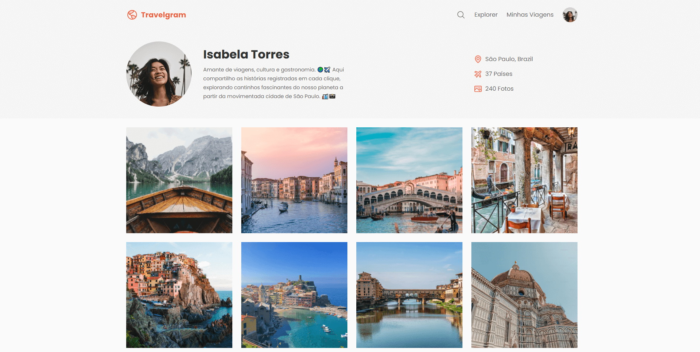

# Travelgram ✈️


*Preview do projeto — página de perfil de viagem.*

Projeto desenvolvido como parte do curso Full-Stack da Rocketseat, utilizando HTML e CSS com foco em conceitos mais avançados de layout.

## Tecnologias
- HTML5
- CSS3

## Objetivo
Praticar a criação de um perfil de viagens, aplicando conceitos mais avançados de estruturação e estilização, como organização de layout, posicionamento de elementos e responsividade.

## Como visualizar
1. Clone o repositório:
   ```bash
   git clone https://github.com/muddyorc/travelgram.git
  
